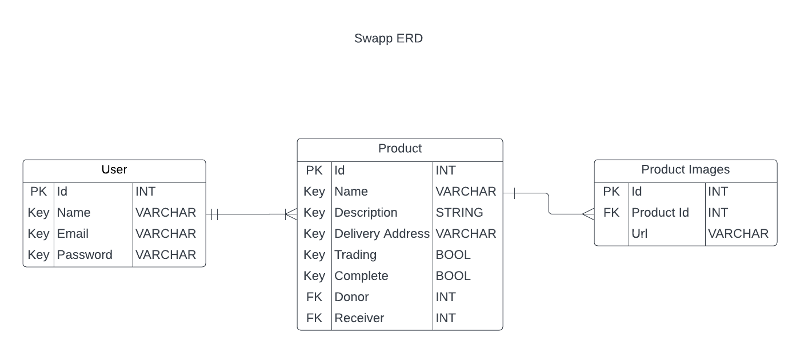

# Swapp

Documentation: https://documenter.getpostman.com/view/18146738/2s83YSKT4c 

## Author
Catherine Muthoni

## Project Description
Swapp is a modern barter trading/donation web app built using Express(Node.js). Users can exchange their old/used/unwanted products with other users' products that they might like upon mutual agreement. Those who do not want to swap their products can also donate them to centers of their choice.

## Features
- User signup and login
- Post a product
- Make Trade Offer
- Accept/Reject Trade Offer

## Main Learnings
- JWT Authentication
- File Upload and Management using Multer

## Entity Relationship Diagram(ERD)
